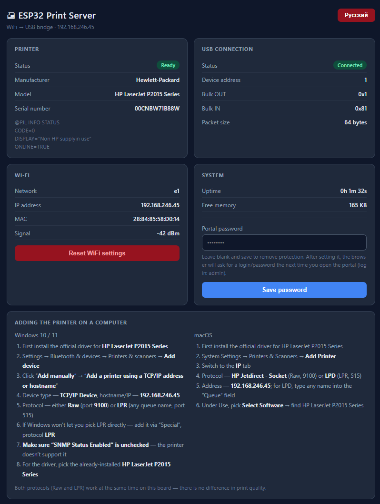

# ESP32-S3-PrintServer

Turn a plain USB printer into a WiFi network printer using an ESP32-S3 as a
USB Host bridge — no Raspberry Pi, no dedicated PC required.

The ESP32-S3's native USB-OTG peripheral acts as a **USB Host**, talks
directly to the printer over its USB Printer Class interface, and exposes it
on your local network as a standard **Raw/JetDirect (port 9100)** and
**LPR/LPD (port 515)** printer — the same protocols real network printers
and print servers use. Any computer on the network (Windows, macOS, Linux)
can add it as a normal TCP/IP printer, install the manufacturer's driver,
and print to it wirelessly.

Built and tested against, for example, an **HP LaserJet P2015**, but should
work with any printer exposing a standard bidirectional USB Printer Class
(07/01) interface.

## Features

- **USB Host bridge** — ESP32-S3's native USB-OTG port drives the printer
  directly; no PC/Pi needed once flashed.
- **Two network print protocols** — Raw/AppSocket on port 9100 and LPR/LPD
  on port 515, both running simultaneously.
- **Real printer identification** — reads the actual USB string descriptors
  (manufacturer/product/serial) reported by the device during enumeration,
  no guessing from VID/PID tables.
- **Live PJL status monitoring** — polls `@PJL INFO STATUS` between jobs for
  PJL-capable (HP-style PCL) printers and surfaces paper-out / offline /
  error conditions on the dashboard.
- **Web dashboard** — a small dark-themed control panel served by the board
  itself: printer state, USB connection details, WiFi info, free memory,
  and step-by-step printer-setup instructions for Windows and macOS with
  the live IP/model substituted in automatically.
- **WiFi setup with network scanning** — the setup page can scan for nearby
  networks and list them (with signal strength and lock icon for secured
  ones) instead of requiring the SSID to be typed by hand; manual entry is
  still available for hidden networks.
- **WPA2-Enterprise (802.1X) support** — in addition to regular WPA2-PSK
  (or open) networks, the setup page can also join PEAP/TTLS+MSCHAPv2
  WPA2-Enterprise networks (e.g. `eduroam` or a corporate WiFi with a
  RADIUS server), using an Identity/Username/Password prompt instead of
  a plain network password.
- **Bilingual UI (RU/EN)** — a single button toggles the whole portal
  between Russian and English; the choice is saved to flash (NVS) and
  survives reboots.
- **Optional portal password** — the whole web interface (dashboard, setup
  page, and every API route) can be protected with an HTTP Basic Auth
  password (login `admin`), settable from either the setup page or the
  dashboard. Left blank, the portal stays open — this is opt-in, not
  required.
- **Optional 0.91" I2C OLED status display** — shows a boot splash and then
  the board's current IP address (home-network IP once connected, or the
  access point's `192.168.4.1` while it isn't), auto-sized to make the best
  use of the small screen via `Adafruit_GFX`'s own text-measurement API.
  Fully optional and gated behind a single `#define` — leave it disabled
  and neither the extra libraries nor the wiring are needed at all.
- **Reliable large-job transfer** — print data is sent through the USB
  Host library's asynchronous write queue with a generous, configurable
  timeout, rather than a single fixed-length blocking write. This avoids
  silently corrupting large jobs (e.g. image-heavy PCL XL jobs) when the
  printer briefly stalls to process data internally — a failure is now
  reported honestly instead of being retried in a way that could duplicate
  bytes on the wire.
- **mDNS + SSDP/UPnP discovery** — the board announces itself on the
  network so it shows up automatically where supported.
- **WiFi setup portal with a real fallback** — on first boot (or after a
  settings reset) the board starts its own access point with a captive
  setup page; no hard-coded credentials in the source. **Printing works
  immediately through this access point too** (`192.168.4.1`), even before
  — or entirely without — configuring a home network, and it keeps working
  as a fallback any time the configured network becomes unreachable.

## Hardware

- An ESP32-S3 board with a native USB-OTG port (tested on an N16R8 module:
  16 MB flash / 8 MB PSRAM).
- A USB Host cable connecting the board's OTG port to the printer's USB-B
  port. **Note:** most ESP32-S3 dev boards have *two* USB-C connectors —
  only one of them is wired to the native USB-OTG peripheral and can act
  as a host; the other is a UART-to-USB bridge used for flashing and is
  not usable for this purpose.
- **Solder jumpers.** Many ESP32-S3 boards ship with two solder-bridge
  pads on the PCB that need to be bridged (shorted) with a blob of solder
  before USB Host mode works at all:
  - the **OTG** jumper — enables the native USB-OTG port for Host mode;
    without it the port stays in device-only mode and no printer will
    ever be detected;
  - the **RGB** jumper — powers the onboard addressable RGB LED, used
    here for at-a-glance status (not required for printing itself, but
    worth bridging if you want the status LED to work).

  Check your specific board's silkscreen/schematic for the exact pad
  labels and location — naming varies slightly between vendors.
- **Optional: a 0.91" I2C OLED display** (SSD1306, 128×32) if you want the
  IP address shown on a screen rather than only checked via the web
  dashboard. Four wires (VCC/GND/SDA/SCL) to any free GPIO pins that don't
  conflict with the ones already used by the reset button and the RGB LED.

## Known-good / known-tricky printers

Any printer with a genuine PCL, PostScript, or similar printer-side
language and a standard USB Printer Class interface should work well,
since the print job is just a pre-rendered byte stream relayed as-is.

Cheap **"GDI" / host-based printers** (e.g. many Canon printers using the
proprietary CAPT protocol) generate the raster data on the PC and often
rely on a tight, low-latency, bidirectional exchange with the printer
during printing. Bridging that reliably over WiFi is a fundamentally
different — and harder — problem than relaying a finished PCL/PostScript
stream, and hasn't been tested here. Your mileage may vary.

## Arduino IDE setup

Board package: **esp32 by Espressif Systems**.

> **Important — core version.** Arduino-ESP32 core **3.3.11** (based on
> ESP-IDF 5.5.5) has a confirmed regression that breaks the native USB Host
> driver on the ESP32-S3 (`HUB: Root port reset failed`, no device ever
> enumerates — see
> [espressif/arduino-esp32#12783](https://github.com/espressif/arduino-esp32/issues/12783)).
> Use **3.3.10** (or whichever version fixes this upstream) via Boards
> Manager until that regression is resolved.

Board settings used during development:

| Setting | Value |
|---|---|
| Board | ESP32S3 Dev Module |
| USB CDC On Boot | Disabled |
| USB Mode | USB-OTG (TinyUSB) |
| Upload Mode | UART0 / Hardware CDC |
| Flash Size | 16MB |
| Partition Scheme | 16M Flash (3MB APP / 9.9MB FATFS) |
| PSRAM | OPI PSRAM |

## Libraries

- [EspUsbHost](https://github.com/tanakamasayuki/EspUsbHost) — Arduino
  wrapper around ESP-IDF's native `usb_host.h` USB Host stack.
- Standard ESP32 Arduino core libraries: `WiFi`, `WiFiUdp`, `ESPmDNS`,
  `Preferences`, `WebServer`.
- Only if the optional OLED display is enabled (`ENABLE_OLED_DISPLAY 1`):
  `Adafruit_SSD1306` and `Adafruit_GFX` (both installable via the Arduino
  Library Manager). With the display disabled, neither is required.

## Quick start

1. Install the board settings above in Arduino IDE, including the core
   version note.
2. Flash the sketch.
3. On first boot the board starts an access point called
   `PrintServer-Setup` (password `12345678`). **You can print right away
   through this access point** — connect a computer to it and add a
   network printer pointing at `192.168.4.1` (Raw port 9100 or LPR port
   515), no home WiFi required. This also works any time the board can't
   reach your configured network, so it always falls back to a usable
   printer instead of going silent.
4. To also make it reachable on your regular home network, open
   `http://192.168.4.1` while connected to that access point, either scan
   for and pick your network or type its SSID manually, and enter its
   password (or Identity/Username/Password for a WPA2-Enterprise network).
   You can optionally set a portal password on the very same page.
5. Once connected to your home network, open the board's IP address in a
   browser for the live dashboard, or visit
   `http://ESP32-PrintServer.local` if your OS supports mDNS.
6. On your computer, add a new network printer pointing at whichever
   address applies (the board's home-network IP once configured, or
   `192.168.4.1` while it's still just running its own access point) —
   either **Raw/AppSocket on port 9100** or **LPR on port 515** — and
   install the printer's normal driver. Step-by-step instructions for both
   Windows and macOS are shown right on the dashboard, with your printer's
   actual model name and the board's current IP filled in automatically.

## Acknowledgements

This project was built collaboratively with **[Claude](https://claude.com)**
(Anthropic) — from the initial hardware bring-up and USB protocol
debugging, through diagnosing a genuinely nasty upstream Arduino-ESP32
core regression, to the web dashboard, bilingual UI, WPA2-Enterprise
support, and the optional OLED status display. 🤖

## License

MIT 
